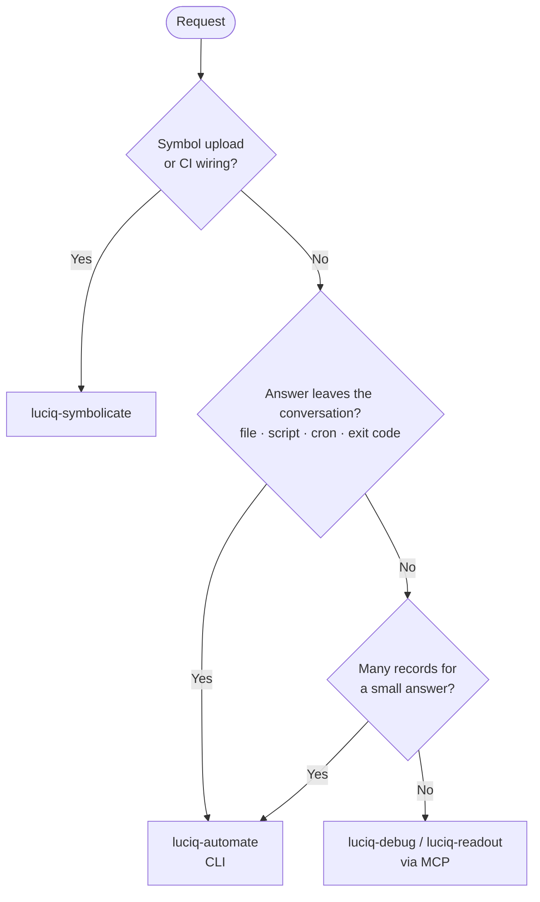

# luciq-automate

A Claude Code / Cursor skill for getting Luciq data **out of the conversation** — into a file, another tool, a scheduled job, or a build's exit code.

If the answer needs hundreds of records but you want three lines, has to land in a spreadsheet, has to run at 6am on a Monday, or has to fail a release when a metric slips, this is the skill for that.

---

## What it does

Every data command here proxies to the **same server-side tool** the Luciq MCP server exposes, under the same role permissions and plan entitlements. So the CLI is never a source of extra data, and never a way around a permission or plan block: that block holds on both paths.

What it does have are three things the MCP doesn't:

| | |
| --- | --- |
| **Determinism and composability** | An exact command you can commit, diff, schedule and pipe. |
| **Volume** | The MCP returns whole records into the conversation. The CLI can reduce them before anything is read. |
| **Exit codes** | The MCP has none, so it cannot gate a build. |

---

## Why it exists

**The volume one is the quiet one.** Answering "how many open crashes per version?" through the MCP means reading every crash in order to count them. On a 208-crash account that is roughly 39,000 characters for a three-line answer.

```bash
# WRONG: pages every open crash into the conversation just to group them
luciq crashes list --slug my-app --mode production --status open --limit 50 --offset 0
luciq crashes list --slug my-app --mode production --status open --limit 50 --offset 50   # ...and so on

# RIGHT: same answer, reduced before it is ever read — under 200 characters
for off in 0 50 100 150; do
  luciq crashes list --slug my-app --mode production --status open --limit 50 --offset $off
done | jq -s '[.[].crashes[]] | group_by(.app_version)
               | map({version: .[0].app_version, count: length}) | sort_by(-.count)'
```

The skill's first job is choosing the instrument at all, and the test is **not how the request was phrased**. A question phrased as a question still belongs here if the answer needs many records, spans several apps, has to land in a file, or has to run unattended.



### Two traps that read like something else

**The JSON is enveloped.** A `jq` filter is `.bugs[]`, not `.[]`. And `alerts list` / `incidents list` return **CSV rows**, not JSON at all, so a `jq` pipeline on them fails in a way that looks like an auth or empty-result problem.

**Querying the wrong `--mode` produces no error.** Each mode is a separate dataset, so `--mode staging` on an app whose traffic is in `production` returns real, correctly-formed, entirely irrelevant data with exit `0`. Worse than an error, and worse still in a scheduled job where nobody eyeballs the result.

### One credential, and what it implies

A CLI token carries its owner's own dashboard role. It is **not** a service account. That is the load-bearing consequence for anything scheduled: a cron job or pipeline step built on it breaks when that person rotates their token or leaves. The skill says so when wiring one, rather than leaving it to be discovered six months later.

---

## How to use it

### Prerequisites

Nothing but a shell. The skill installs and authenticates the CLI as its first step; all you supply is a CLI token, generated at [dashboard.luciq.ai/company/luciq-cli](https://dashboard.luciq.ai/company/luciq-cli).

### Try saying

- `"Export every open crash across all our apps to a CSV"`
- `"How many open crashes per app version? Just the counts"`
- `"Run this crash summary every Monday at 8am"`
- `"Stop the release automatically if crash-free sessions drop below 99%"`
- `"Feed our open crash list into ./tools/ingest.sh"`
- `"Put something in the repo so any engineer can pull the same numbers"`

### What you get

A command shown before it runs, with a real slug resolved from `luciq apps list` rather than guessed, secrets as `"$VAR"`, and the reduction done in the pipe rather than in the conversation. For a build gate, an exit code with a failure message that says which threshold broke and what the actual value was. Writes are shown verbatim and wait for explicit approval.

---

## File map

```
plugins/luciq-skills/
├── commands/
│   └── luciq-automate.md             ← /luciq-automate slash command
└── skills/
    └── luciq-automate/
        ├── README.md                 ← you are here (human-facing)
        ├── SKILL.md                  ← LLM-facing instructions; the workflow definition
        └── references/
            ├── command-reference.md  ← every group, subcommand, typed flag, sort field, --filters key
            └── troubleshooting.md    ← error → cause → fix, per-command permissions, output-shape traps
```

References load only when the current step needs them.

---

## Status

The command surface, flags, enum values, error text, and exit-code behavior were derived from the `luciq-cli` source and the server-side gateway that serves its commands, and cross-checked against the public [CLI docs](https://docs.luciq.ai/product-guides-and-integrations/product-guides/luciq-cli/getting-started).

**Verified against a live authenticated account** — every read command was run and its response shape recorded, which corrected two assumptions worth calling out:

- The JSON is **enveloped** (`{"bugs": […]}`, `{"crashes": […]}`, `{"network_groups": […]}`), so a `jq '.[]'` filter is wrong. `apps list` also returns each app's **SDK token**, so its raw output is secret-bearing.
- `alerts list` and `incidents list` return **CSV rows**, not JSON — and `alerts list` accepts no pagination flags at all.

Also verified by running the CLI: Thor's argument-validation messages, the `✗ Request failed (401)` shape, `bugs update`'s no-change guard, non-zero exit on failure, and that CLI errors print to **stdout** while argument errors print to **stderr** — which is why the skill says to trust the exit code, not an empty stderr.

Read from the gateway source rather than assumed: the `account_management.cli.view` gate, the per-command permission and plan-feature map in `troubleshooting.md`, and the **100 requests / 60 s per source IP** rate limit — keyed by IP, so jobs sharing a CI runner share one budget.

The standing rule for anything that drifts: `luciq <group> help <subcommand>` outranks these tables.

---

## Related skills

- **`luciq-symbolicate`** — the other half of the CLI: symbol uploads and wiring them into a release pipeline.
- **`luciq-debug`** — root-cause one crash, hang, bug, or regression against your repo, via MCP. Use it for "why is this happening"; use this skill when the answer has to leave the chat.
- **`luciq-readout`** — an audience-tailored health report for humans, via MCP.
- **`luciq-group-bugs`** — rule-based bug deduplication with a plan-and-approve gate. `luciq bugs update --duplicate-of` is the single-bug version; that skill handles many.
- **`luciq-alert-config`** / **`luciq-alert-gaps`** / **`luciq-alert-noise`** — conversational alert authoring and auditing. `luciq alerts` is the scriptable equivalent.
