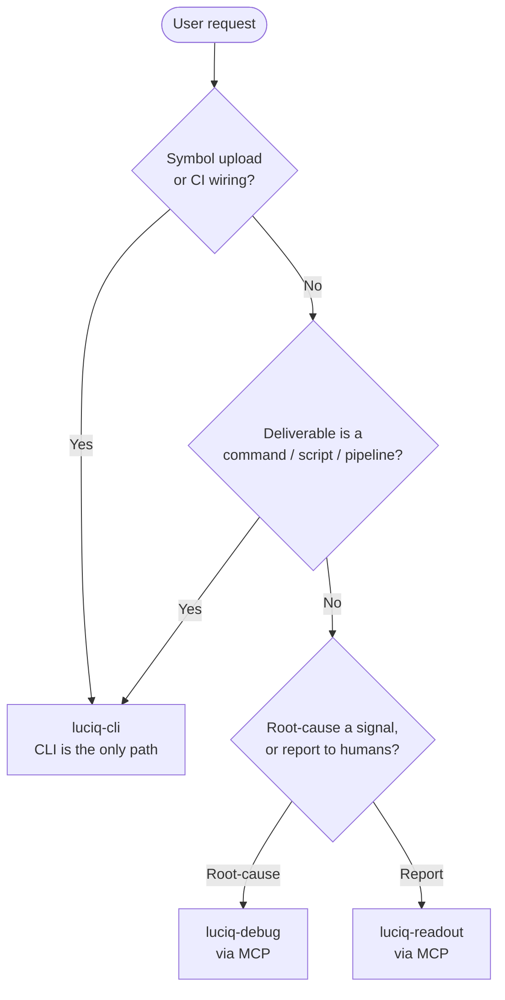
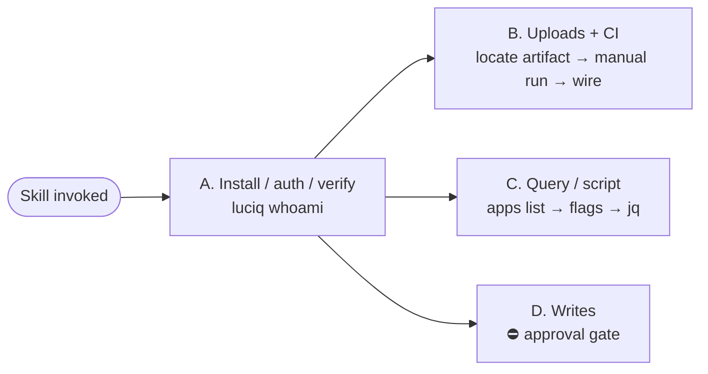
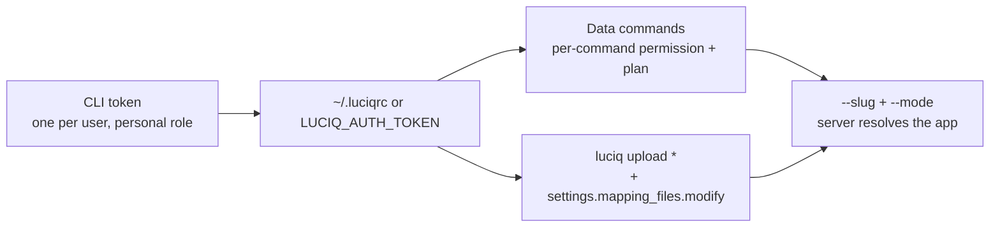

# luciq-cli

A Claude Code / Cursor skill for driving Luciq from a **terminal, a build pipeline, or a script** — installing and authenticating the `luciq` CLI, uploading symbol files, wiring symbolication into CI, and turning a data question into a repeatable command.

If you've ever shipped a release and then found the crash reports were unreadable because nobody uploaded the mapping file, this is the skill for that. It also covers the everyday half: the exact `luciq ...` invocation for a question you'd otherwise click through the dashboard to answer.

---

## What it does

The Luciq CLI has two halves, and they behave differently enough that guessing goes wrong quickly:

- **Symbol uploads** — dSYMs, ProGuard/R8 mappings, NDK `.so` files, React Native source maps, Flutter Dart symbols. **No MCP tool exists for these**, so the CLI is the only path.
- **Data commands** — crashes, bugs, APM, reviews, surveys, issues, opportunities, alerts, incidents, insights. Each one runs the *same server-side tool* the Luciq MCP server exposes, under the same role permissions and plan entitlements.

Both halves authenticate with one CLI token (`luciq login` / `LUCIQ_AUTH_TOKEN`) and target an app by `--slug` + `--mode`; no application token is ever passed on the command line.

The skill's first job is choosing the right instrument at all: **a question is MCP's job; a command, a pipeline step, or a script is the CLI's**. Its second job is not making things up — a CLI has a finite flag surface, and an invented `--since` or `--json` flag is a broken command handed to someone who trusted it. So the skill treats `luciq help` as outranking its own reference tables, every time a flag is rejected.

---

## How it works

### Instrument choice comes first



Both paths hit the same backend, so the CLI is never a way around a permission or plan block — that block holds on both. The one real capability gap runs the other way: uploads.

### Four tracks



Track B carries the load-bearing rule: **one manual upload must print `✓` before any CI file is touched.** A committed pipeline step that has never uploaded successfully is an untested change on a release path — and its failure mode is silent, surfacing weeks later as an unreadable stack trace.

### One credential, and what it implies



A CLI token carries its owner's own dashboard role — it is not a service account. That's the load-bearing consequence for CI: an upload step runs as a *person*, needs `settings.mapping_files.modify` on the app, and breaks when that person rotates their token or leaves. The skill makes that explicit when wiring a pipeline instead of leaving it to be discovered later.

---

## How to use it

### Prerequisites

Nothing but a shell — the MCP server isn't involved at all. The skill installs and authenticates the CLI as part of Track A; all you supply is a CLI token, generated at [dashboard.luciq.ai/company/luciq-cli](https://dashboard.luciq.ai/company/luciq-cli).

### Try saying

- `"Install the Luciq CLI and log me in"`
- `"Upload the dSYMs for this build to Luciq"`
- `"Add Luciq symbol upload to our GitHub Actions release workflow"`
- `"Our Android crashes aren't deobfuscated — fix it"`
- `"Give me a command that lists open crashes for my-app and pipes it into jq"`
- `"Script a daily check for open Luciq incidents"`

### What you get

A command shown before it runs, with real paths and secrets as `"$VAR"`; a manual upload proven before any pipeline edit; a diff plus a note of exactly which secret to configure where. Writes (`bugs update`, `alerts create|update|delete`, `incidents resolve|reopen`, funnel changes) are shown verbatim and wait for explicit approval.

---

## File map

```
plugins/luciq-skills/
├── commands/
│   └── luciq-cli.md                  ← /luciq-cli slash command (invokes this skill)
└── skills/
    └── luciq-cli/
        ├── README.md                 ← you are here (human-facing)
        ├── SKILL.md                  ← LLM-facing instructions; the workflow definition
        └── references/
            ├── command-reference.md  ← every group, subcommand, typed flag, sort field, --filters key
            ├── upload-matrix.md      ← upload subcommands, artifact locations, required flags, format traps
            ├── ci-recipes.md         ← GitHub Actions, Fastlane, Gradle, Bitrise, CircleCI, Xcode phase, cron
            └── troubleshooting.md    ← error → cause → fix, per-command permissions, unsymbolicated triage
```

References load only when the active track needs them.

---

## Status

The command surface, flags, enum values, error text, and exit-code behavior were derived from the `luciq-cli` source and the server-side gateway that serves its commands, and cross-checked against the public [CLI docs](https://docs.luciq.ai/product-guides-and-integrations/product-guides/luciq-cli/getting-started).

**Verified against a live authenticated account** — every read command was run and its response shape recorded, which corrected two assumptions worth calling out:

- The JSON is **enveloped** (`{"bugs": […]}`, `{"crashes": […]}`, `{"network_groups": […]}`), so a `jq '.[]'` filter is wrong. `apps list` also returns each app's **SDK token**, so its raw output is secret-bearing.
- `alerts list` and `incidents list` return **CSV rows**, not JSON — and `alerts list` accepts no pagination flags at all. Those are the two commands where a `jq` pipeline fails outright; everything else emits JSON.

Also verified by running the CLI: Thor's argument-validation messages, the `✗ Request failed (401)` shape, `bugs update`'s no-change guard, local pre-flight validation on uploads (path, readability, `.zip`-vs-`.json`, `--arch`), non-zero exit on failure, and that CLI errors print to **stdout** while argument errors print to **stderr** — which is why the skill says to trust the exit code, not an empty stderr.

Read from the gateway source rather than assumed: the `account_management.cli.view` gate, the extra `settings.mapping_files.modify` on uploads, the per-command permission and plan-feature map in `troubleshooting.md`, and the **100 requests / 60 s per source IP** rate limit — keyed by IP, so jobs sharing a CI runner share one budget.

Real symbol uploads weren't exercised end to end. The standing rule for anything that drifts: `luciq <group> help <subcommand>` outranks these tables.

---

## Related skills

- **`luciq-debug`** — root-cause one crash, hang, bug, or regression against your repo, via MCP. Use it for "why is this happening"; use this skill for "give me the command".
- **`luciq-readout`** — an audience-tailored health report. Reads the same data through MCP and renders it for humans.
- **`luciq-group-bugs`** — rule-based bug deduplication with a plan-and-approve gate. `luciq bugs update --duplicate-of` is the single-bug version; that skill handles many.
- **`luciq-alert-config`** / **`luciq-alert-gaps`** / **`luciq-alert-noise`** — conversational alert authoring and auditing. `luciq alerts` is the scriptable equivalent.
- **`luciq-setup`** — first-time SDK integration. This skill installs a CLI, not an SDK.
