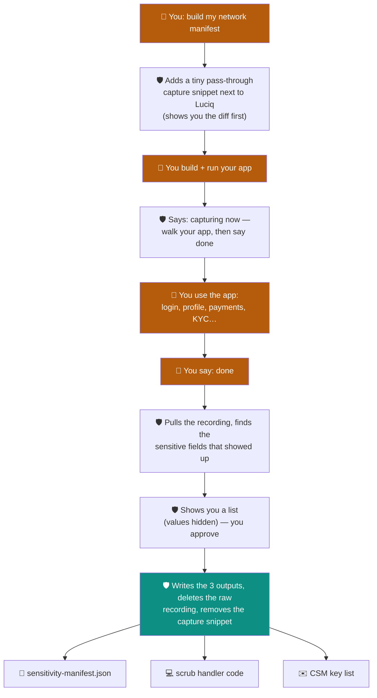

# luciq-network-masking

**Watch your app's network traffic once, then let the skill write the code that hides the sensitive data in it.**

---

## The problem it solves

Luciq records your app's network calls so you can debug them. Those recordings can accidentally capture private data — passwords, emails, card numbers, national IDs.

Luciq automatically hides a fixed set of **header keys** for you. But it **can't** hide anything inside:

- request/response **bodies**, or
- the **URL path**.

That part is your job — and doing it by hand means guessing which fields are sensitive and hand-writing masking code for every platform.

**This skill does both for you.** You run your app normally for a few minutes; it figures out what's sensitive and writes the masking code.

---

## How it works

You do four things — **add the snippet, build & run, walk your app, say "done."** Everything else is automatic.



---

## What you get

| Output | What it is |
|---|---|
| `sensitivity-manifest.json` | The list of sensitive body fields and URL patterns. |
| Scrub handler code | Ready-to-use masking code, wired in, shown as a diff before it's written. |
| CSM key list | Header / query keys to email your Luciq contact (hidden server-side, not in code). |

---

## Why it's safe

- **No proxy, no certificate setup, no pinning problems, no Frida.** It reads traffic at Luciq's own **obfuscation seam** — the same place your masking code will live — so there's nothing to configure on the device.
- **The only change is a tiny temporary snippet,** shown to you as a diff. It's **pass-through**: it reads the traffic and returns it unchanged, and it's **removed as soon as the outputs are written.**
- **Private data stays private.** The recording is written only to the app's own sandbox, is never shown to you in full (only `4…1 (16 chars)`-style previews), and is **deleted** once the outputs are written.

---

## How to start

Just say one of:

- *"What sensitive data is in my network calls?"*
- *"Build my Luciq network manifest"*
- *"Capture my network PII"*

### What you need first

- An **initialized Luciq SDK** and an app you can **build from source** (the capture adds a temporary snippet and rebuilds).
- A **simulator, emulator, or device** to run a debug build on.

No Frida, no proxy, no certificates. If the SDK isn't installed yet, start with **`luciq-setup`**. If you can't rebuild the app (no source), the capture can't apply.

---

## Builder, not auditor

This skill **builds** masking from live traffic. To check whether your existing masking is *enough* (HIPAA / GDPR / PCI), use **`luciq-masking-rules`** — it reads the manifest this skill produces.

| | luciq-network-masking (this) | luciq-masking-rules |
|---|---|---|
| **Job** | **Builds** masking from live traffic | **Audits** what's already there |
| **You say** | "build my network manifest" | "audit my PII" |
| **Works on** | Your running app's traffic | Your code + SDK config |

---

## One honest limit

It can only find data in the paths you **actually use** during the walk. Screens you skip won't be covered — so walk every important flow, and re-run later if you add new ones. The skill tells you how many endpoints it saw, so you can judge coverage.

---

## What's inside

```
luciq-network-masking/
  SKILL.md                     the steps the assistant follows
  assets/
    seam-dump/
      ios.swift                iOS capture snippet (pass-through, temporary)
      android.kt               Android capture snippet (pass-through, temporary)
      README.md                per-platform seam-dump guide
  generators/
    classify.py                finds the sensitive fields
    emit_manifest.py           writes the manifest + CSM list
    handlers/                  iOS · Android · React Native · Flutter code templates
  references/
    preflight.md · routing.md · capture-engine.md · safety.md
```
