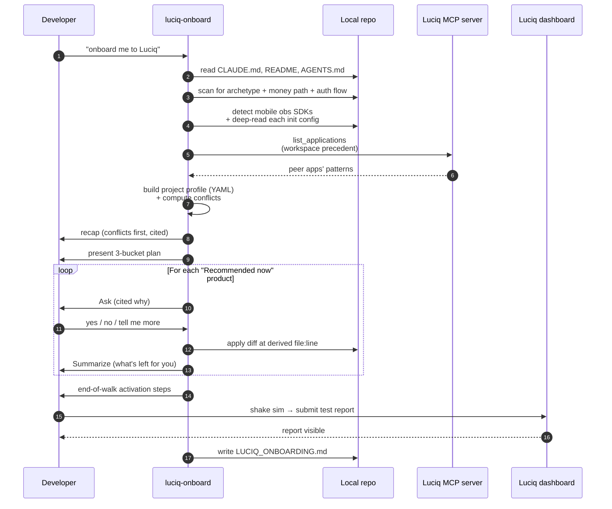
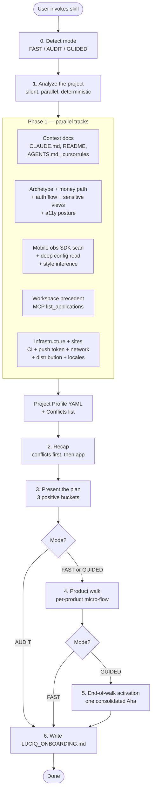
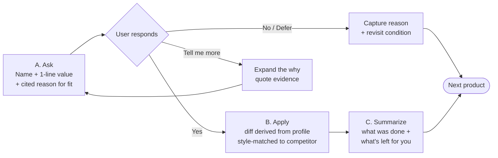
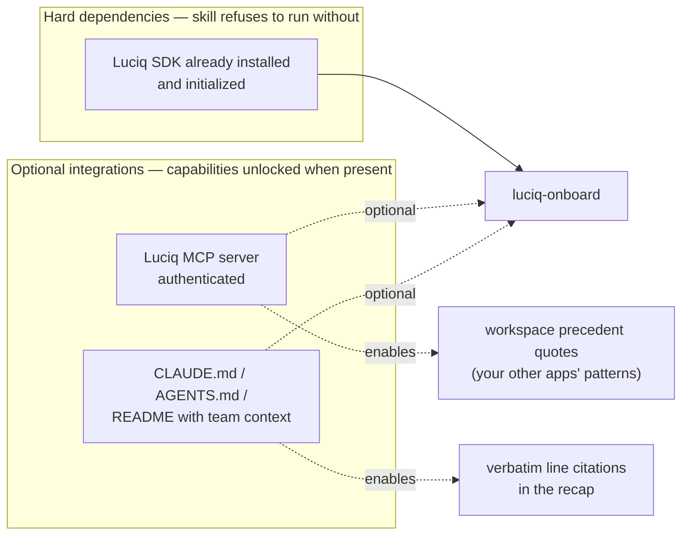

# luciq-onboard

A Claude Code / Cursor skill that takes a user from *"the SDK is installed"* to *"I know which Luciq products fit my app and I've seen my first data on the dashboard"* — through a conversational, evidence-cited walkthrough rather than a generic feature menu.

If you've ever finished installing an SDK and wondered *"OK, what now? Which features actually matter for an app like mine?"* — that's this skill.

---

## At a glance

Four (sometimes five) analysis tracks run **in parallel** before a single word is said to the user. Everything downstream — the recap, the plan, the per-product diffs, the activation — is driven from the structured profile those tracks produce.

```
                  ┌───────────────────────────────────┐
                  │  Customer says: "onboard me to    │
                  │   Luciq" (SDK already installed)  │
                  └─────────────────┬─────────────────┘
                                    │
                                    ▼
            ┌───────────── SILENT PARALLEL SCAN ─────────────┐
            │                                                │
   ┌────────┴────────┐ ┌──────────────┐ ┌──────────────┐ ┌───┴────────────┐
   │   A. Context    │ │ B. Archetype │ │ C. Competing │ │ D. Workspace   │
   │   CLAUDE.md,    │ │ + money path │ │ SDKs + their │ │ precedent      │
   │   README, docs  │ │ + auth flow  │ │ live config  │ │ (Luciq MCP:    │
   │   → quotables   │ │ + sensitive  │ │ → what's on/ │ │ other apps in  │
   │                 │ │   views      │ │ off/tuned    │ │ this workspace)│
   └────────┬────────┘ └──────┬───────┘ └──────┬───────┘ └───┬────────────┘
            │                 │                │             │
            │         ┌───────┴──────┐         │             │
            │         │ E. Infra:    │         │             │
            │         │ CI, push,    │         │             │
            │         │ network, dist│         │             │
            │         │ locales, a11y│         │             │
            │         └───────┬──────┘         │             │
            └─────────────────┴────────────────┴─────────────┘
                                    │
                                    ▼
                  ┌─────────────────────────────────┐
                  │  Conflict detection             │
                  │  (dual crash handlers, racing   │
                  │   ANR detectors, etc.)          │
                  └─────────────────┬───────────────┘
                                    ▼
                  ┌─────────────────────────────────┐
                  │  RECAP — cite the customer's    │
                  │  own code/docs back to them     │
                  │  ("your CLAUDE.md line 12 says… │
                  │   so I'll default masking on    │
                  │   checkout aggressive")         │
                  └─────────────────┬───────────────┘
                                    ▼
                  ┌─────────────────────────────────┐
                  │  THE PLAN — 3 positive buckets  │
                  │  • Recommended now              │
                  │  • Optional                     │
                  │  • Add later (with WHEN)        │
                  └─────────────────┬───────────────┘
                                    ▼
                  ┌─────────────────────────────────┐
                  │  PER-PRODUCT WALK               │
                  │  Ask → show diff → Apply →      │
                  │  Summarize. One beat at a time. │
                  └─────────────────┬───────────────┘
                                    ▼
                  ┌─────────────────────────────────┐
                  │  ONE AHA MOMENT                 │
                  │  end-to-end activation: shake → │
                  │  report → data on dashboard     │
                  └─────────────────┬───────────────┘
                                    ▼
                  ┌─────────────────────────────────┐
                  │  Handoff: LUCIQ_ONBOARDING.md   │
                  │  (durable, queryable next week) │
                  └─────────────────────────────────┘
```

The mermaid diagrams further down go deeper on each phase; this one is the shareable overview.

---

## What it does

Once the Luciq SDK is initialized (typically by `luciq-setup`), `luciq-onboard` reads the user's repo and surrounding context, detects what observability they already have, and walks them through the Luciq products that actually fit — with cited rationale at every step.

It's *not* a config wizard. Every recommendation names its source: a `CLAUDE.md` line quoted verbatim, a `file:line` in the user's code, an inferred archetype, a precedent from their other Luciq apps, or the configured posture of a competitor SDK already in the project. The Aha moment isn't the recommendation — it's the citation.

The skill specifically:

- Reads `CLAUDE.md`, `AGENTS.md`, `.cursorrules`, `README.md`, and other context docs to learn the team's stated intent.
- Detects every active mobile observability SDK in the project (Sentry, Firebase Crashlytics, Bugsnag, Datadog RUM, Embrace, New Relic Mobile, Microsoft App Center, the legacy Instabug SDK, UXCam, Smartlook, and MetricKit as a system-native complement).
- Reads each detected SDK's **actual config** at its init site — what's on, what's off, what's tuned — and infers the team's style (privacy-conservative, low sample, strict env gating, etc.).
- **Enumerates individual sensitive views per screen** — not just *"mask the checkout screen"* but *"these 4 specific `TextField`s on `CheckoutView.swift` bind to card / CVV / address — here are the per-view `.luciq_privateView()` markers, per-match confirm."* Translates competitor-declared view-level masking patterns (Sentry replay `mask` tags, UXCam occlusions, Smartlook blacklisted views) into the equivalent Luciq markers so the team's existing privacy decisions carry over.
- **Reads accessibility posture** — counts `accessibilityIdentifier` / `contentDescription` / `testID` / `Semantics` usage on interactive views and pairs it with CLAUDE.md / README mentions of WCAG, VoiceOver, TalkBack. Teams with strong a11y posture get more accessible defaults — e.g. Bug Reporting invocation defaults to the floating button (operable via screen reader / switch control) alongside shake, since shake is hostile to motor-impaired users.
- **Detects infrastructure and integration sites** (CI system, push token registration, network client + base URLs, distribution channel, locales count) so what would otherwise be doc-pointer left-for-you items become real Phase-4 diffs against existing workflow files, push hooks, and network init sites.
- Surfaces real conflicts honestly (e.g. dual crash signal handlers between Sentry + Crashlytics) **before** proposing any Luciq product. Independent of Luciq, just honest.
- Cross-references the user's other apps via the Luciq MCP server when authenticated, to surface "your team already does this on your other apps" precedents.
- Recommends Luciq products in three positively-framed buckets — **Recommended now**, **Optional**, **Can be added later** (with a specific revisit condition). Never says "not a fit."
- Matches Luciq's defaults to the detected competitor's posture — if Sentry runs replay at 5% and disables screenshots, Luciq's defaults inherit that.
- Drives a single end-of-walk activation moment — one concrete round-trip from the app to the dashboard that proves Luciq is working end-to-end.
- Writes `LUCIQ_ONBOARDING.md` at the repo root capturing every decision, every deferred item with its revisit condition, every conflict surfaced, and the dashboard URL — durable, queryable by sibling skills, appended (never overwritten) across sessions.

---

## How it works

### Big picture



### The workflow

Six phases. The first one is one decision, the second one runs in parallel and silent, the rest are conversational.



### Three speed modes, picked from the user's phrasing

| Mode | Trigger phrasing | Behavior |
|---|---|---|
| **GUIDED** *(default)* | "onboard me to Luciq", "walk me through Luciq", "tour Luciq" | Full arc with conflict recap, per-product walk, end-of-walk activation. ~10 minutes. |
| **FAST** | "must-haves", "fast", "quick", "just the basics" | Apply the top 3 "Recommended now" products with one-line confirms each. No end-of-walk activation. ~2 minutes. |
| **AUDIT** | "what am I missing", "audit", "what should I set up" | Report-only. Print the analysis, present the plan in three buckets, write the handoff doc. Applies nothing without explicit per-product confirmation in a follow-up. |

### The per-product micro-flow

For each product in "Recommended now" (and any "Optional" the user opts into), three conversational beats:



That's it. No 5-step preamble, no quizzes, no wizard forms — three beats per product. The "what's left for you" block points only at SDK + dashboard actions the user genuinely needs to take; it never names third-party tools.

### Three positive buckets, never negative labels

The plan presented in Phase 3 always uses positively-framed bucket names. The skill never says "not a fit" or "skip" — it says "can be added later, when X."

| Bucket | Meaning | Example |
|---|---|---|
| **Recommended now** | Strong fit, applying this session | Bug Reporting, Crash Reporting, APM, Session Replay — recommended on their own merits regardless of competitor presence; competitor coverage is named honestly in the Ask, not used as a downgrade |
| **Optional — add if you'd like** | Reasonable fit, user's call | A product where the fit signal is partial — e.g. APM on a single-screen utility (low-value, not no-value) |
| **Can be added later** | Better *timed* for the future, with the revisit condition stated | App Ratings (when on the App Store) · In-App Replies (when `identifyUser` is wired) · Feature Requests (when user base is active) |

Every "later" item names its revisit condition — and the condition is always about *timing* (pre-launch, missing prerequisite, awaiting a real-world event). **Competitor presence is never a reason to defer a Luciq product.** If a competitor SDK covers similar ground, the skill names it in the Ask and lets the customer decide whether to adopt alongside, evaluate as a swap, or stay on what they have. The handoff doc captures both the condition and the reason so the next session — possibly with a different operator — picks up exactly where this one left off.

### Conflict detection — honest first, never blocking

Conflicts are computed in the same pass as the SDK scan (no separate phase) and surfaced at the top of the recap. They're always framed independently of Luciq:

> Heads-up: Sentry (AppDelegate.swift:23) and Firebase Crashlytics (AppDelegate.swift:18) both install crash signal handlers. Only one captures any given crash today — your crash capture is non-deterministic. Worth fixing regardless of what we do next.

Three severity tiers:

| Severity | Examples | Surfaced in |
|---|---|---|
| **High** | Dual crash handlers, replay collision, ANR detector race | Recap (verbatim) + handoff doc |
| **Medium** | Network interceptor stack overlap, lifecycle swizzling overlap | Recap (one-liner) + handoff doc |
| **Low** | Shelf-ware packages, deprecated SDK still in manifest | Handoff doc only |

Conflicts are **highlighted, never blocking**. A user who came to onboard shouldn't get stuck in housekeeping. The user can acknowledge a conflict and proceed; it's captured in the handoff for accountability.

### End-of-walk activation — one Aha, not N

After all selected products are configured, the skill drives **one** consolidated activation moment using the primary product (typically Bug Reporting) as the verification vehicle:

> All set. To see Luciq working end-to-end:
>  1. Build and launch the app.
>  2. Shake the simulator (Ctrl+Cmd+Z).
>  3. Type "test from onboarding" and submit.
>  4. Open your dashboard: `<deep link to Bugs surface for this app>`
>
> Tell me when you see the report — or just come back later.

The skill waits for explicit confirmation that data is visible. It never claims success without the user confirming. If 60s pass with no event, it diagnoses (build still running? wrong token? simulator not invoking?) rather than fabricating success.

---

## How to use it

### Prerequisites



**Hard dependency.** The SDK must already be initialized. If `Luciq.start(...)` (or the equivalent for the platform) isn't present, the skill is the wrong one — `luciq-setup` first, then come back here. The recommendations from `luciq-onboard` against an uninstrumented app would be guesses; the skill bails rather than pretend otherwise.

**Optional but valuable.**

- **Luciq MCP server, authenticated.** Without it, the workspace-precedent track in Phase 1 silently no-ops — recommendations still happen, just without the *"your other 3 apps already do this"* citation. Authenticate via your IDE's MCP config; see https://docs.luciq.ai/product-guides-and-integrations/product-guides/ai-features/luciq-mcp-server/setup-by-ide.
- **`CLAUDE.md` / `AGENTS.md` / a rich `README.md`.** Without these, the recap leans on archetype + code-signal inference; with them, the recap can quote the team's stated intent verbatim — which is what makes the conversation feel uncanny.

### First invocation

Trigger the skill naturally — *"onboard me to Luciq"*, *"walk me through Luciq"*, *"help me get started with Luciq"*, *"what Luciq products should I use"*, *"what should I set up with Luciq"*. The skill also fires on related phrasings; the description in `SKILL.md` is intentionally pushy to combat undertriggering.

What happens on first run:

1. The skill confirms the mode (defaults to GUIDED — full walk, ~10 minutes).
2. Phase 1 runs silently: reads context docs, scans for archetype + money path + auth flow, detects mobile observability SDKs and reads each one's actual config, calls the Luciq MCP for workspace precedent.
3. Phase 2 opens the conversation with any conflicts found, then a cited recap of what the skill learned about the app.
4. Phase 3 presents the plan in three buckets. The user can move items between buckets before the walk begins.
5. Phase 4 walks each "Recommended now" product through Ask → Apply → Summarize. Skip / defer is first-class at every product; reasons are captured.
6. Phase 5 (GUIDED only) drives one end-of-walk activation moment.
7. Phase 6 writes `LUCIQ_ONBOARDING.md` at the repo root.

### Subsequent runs

The skill is idempotent. Running it again on a project that has been through it once is fine — it re-reads the current profile, surfaces any new conflicts or competitor SDKs that appeared since the last session, identifies any "Can be added later" items whose revisit conditions are now met (e.g. *"App Ratings — revisit when on App Store"* fires once the app has an App Store presence), and presents an updated plan. The handoff doc gets a new dated session block appended; prior sessions are preserved.

### Reading the handoff doc

`LUCIQ_ONBOARDING.md` at the repo root is the durable artifact of every onboarding session. It contains:

- **Products active** for each session — what was configured, the file:line edited, the decisions made with cited reasons, and (when verified) the timestamp of the first data observed on the dashboard.
- **Products you can add later** — each with a specific revisit condition (`when on the App Store`, `after wiring identifyUser`, etc.).
- **Products already covered by another SDK** — named, with the file:line of the competitor's init call. Frames future vendor consolidation as a one-skill job, never as a sales push.
- **What's left for you** — the doc-pointer items from each active product, deduplicated across the walk. Only SDK + dashboard items; never third-party tool names.
- **Conflicts detected** — every one surfaced in Phase 2, with file:line evidence and the status this session (addressed / not addressed). Conflicts that weren't fixed remain visible across future sessions until they are.
- **Context the skill used** — the CLAUDE.md lines cited, the money path file:line, the auth flow file:line, the detected SDK style one-liner, and the workspace precedent quote (or *MCP not authenticated*). Lets a future operator see *why* recommendations landed as they did.
- **Pointers to sibling skills** — when to reach for `luciq-debug`, `luciq-migrate`, `luciq-verify`.

Re-readable next week. Hand-off-able to a teammate. Queryable by `luciq-debug` later when investigating a specific incident.

### What products the skill knows about

| Product | One-line value | Strongest fit signals | Anti-signals (deferred) |
|---|---|---|---|
| **Bug Reporting** | Users shake / screenshot to send a report with logs, network, video | Universal — any app with real users | Almost none |
| **Crash Reporting** | Fatal crashes with repro steps + session context | Any production app — universal fit | Unresolved dual-crash-handler conflict |
| **APM** | Slow screens, slow network, hangs, Apdex | E-commerce checkout, social feed, anywhere speed shows up in support | Hobby or single-screen utility (signal too low) |
| **Session Replay** | Watch the actual session that led to a bug or crash | High-stakes flows; reports where repro steps fail | Privacy-strict apps without robust masking |
| **In-App Surveys** | Ask users questions in-context — NPS, satisfaction, exit | Retention / engagement goals, post-action prompts | Pre-launch, very low DAU |
| **App Ratings & Reviews** | Prompt happy users for a store rating; route unhappy ones to feedback | Consumer apps with store presence and growth goals | B2B / enterprise / internal tools |
| **Feature Requests** | Users submit and vote on ideas in-app | Product-led growth, B2B SaaS, engaged consumer communities | Pre-launch, transactional one-time-use apps |
| **In-App Replies** | Reply to reports / requests / surveys directly in-app | Support-conscious teams (B2B, premium tier consumer) | No auth flow / `identifyUser` not wired |
| **Feature Flags** | Tie experiment variants to crashes, perf, and bug reports | Existing experimentation SDK (LaunchDarkly / Statsig / Optimizely / Firebase RC / Amplitude); A/B tests in CLAUDE.md | Pre-launch; no experimentation in code |
| **APM Flows** | Multi-step user journey completion rate + P50/P95 + drop-off cause | Money path with 2+ screens; e-commerce / fintech / funnel-heavy archetypes; CLAUDE.md mentions conversion | Single-screen utility; APM not also adopted; SDK < v13 |

Per-product cards (apply targets, style-match rules, what's-left-for-you copy) live in `references/product-cards.md` and are the source of truth — easy for the DX/PMM team to edit without touching the skill prompt.

**Capabilities not in the buckets.** Several Luciq capabilities are auto-derived from configured products, live entirely on the dashboard, or need Luciq support / account-admin enablement — they're not products to apply during the walk. Frustration-Free Sessions, App Health Dashboard, Issues List, Business Impact, Alerts & Rules, Rollout Management, Team Ownership, One Code Apps, and the Detect / Resolve / Release AI agents fall in this category. The skill catalogues them in `references/post-onboarding-capabilities.md` and surfaces them in the handoff doc under "Dashboard capabilities now active" and "Capabilities that unlock later" — never in the Phase-3 buckets.

### What mobile observability SDKs the skill detects

The v1 detection set covers the SDKs that show up in the vast majority of real customer projects:

- **Full-stack competitors.** Sentry, Bugsnag, Embrace, Instabug (legacy — routes to `luciq-migrate`).
- **Crash-only.** Firebase Crashlytics, Microsoft App Center (deprecated 2025-03-31, still common).
- **APM / RUM.** Datadog RUM, New Relic Mobile.
- **Session replay.** UXCam, Smartlook.
- **System-native (complement, never competitor).** MetricKit (iOS).

For each detected SDK the skill extracts the *actual* config at the init site — sample rates, masking lists, screenshot capture, env gating, custom filter callbacks — and infers a one-line **style** that Luciq's defaults then match. *"Sentry — privacy-conservative, low sample, strict env gating"* in the recap is what makes the conversation feel like the agent understood the team's posture, not just their SDK list.

Detection patterns and config-key extraction rules per SDK live in `references/observability-sdks.md`. Detection is fully deterministic — grep + small AST passes, no LLM in detection. LLM is only used in the per-product fit reasoning, and that step reads the structured profile, not raw config.

---

## File map

```
plugins/luciq-skills/
└── skills/
    └── luciq-onboard/
        ├── README.md            ← you are here (human-facing)
        ├── SKILL.md             ← LLM-facing instructions; the workflow definition
        └── references/
            ├── product-cards.md                  ← Per-product fit, apply targets, what's-left-for-you (10 products)
            ├── observability-sdks.md             ← Detection patterns, config-key extraction, coverage matrix, conflict rules (10 SDKs)
            ├── post-onboarding-capabilities.md   ← Dashboard-only / auto-derived / support-gated capabilities (handoff-doc inputs, never bucketed)
            └── handoff-template.md               ← LUCIQ_ONBOARDING.md template with a worked example
```

The references are loaded by the skill only when the corresponding phase needs them — progressive disclosure keeps `SKILL.md` focused on workflow orchestration while the per-product copy, per-SDK detection patterns, and handoff template can evolve independently.

---

## Status

**This skill is in initial release.** The workflow, product cards, SDK detection patterns, and handoff template are designed against the live Luciq docs and the existing sibling skills' conventions.

What's still being refined as it sees real customer sessions:

- Per-product fit-scoring thresholds — what tips a product from "Optional" to "Recommended now" for borderline archetypes.
- Style-inference rules for each competitor SDK — currently four signals per SDK (privacy posture, sampling budget, env gating, filter discipline); may grow as patterns emerge.
- The end-of-walk activation timing — 60s polling threshold before diagnosing is a starting heuristic; may tune based on real first-event latencies.
- v2 of the SDK detection set — additions like Helpshift, Apptentive, Pendo Mobile, Raygun, Dynatrace Mobile are queued for v2 once v1 customer sessions show what's actually missing.

Behavioral findings worth knowing before you run the skill:

1. **`list_applications` fails silently for first-time MCP users.** When the MCP server isn't authenticated, the workspace-precedent track in Phase 1 no-ops without nagging. Recommendations still produced, just without precedent citations. This is intentional — the first time you run `luciq-onboard` on a brand-new account, you shouldn't be blocked by an auth flow.
2. **The skill bails if Instabug (legacy) is detected.** Onboarding makes no sense against a legacy baseline — `luciq-migrate` is the right tool. The skill exits with a clear pointer.
3. **The skill never overwrites `LUCIQ_ONBOARDING.md`.** Existing sessions are preserved; new sessions are appended with a dated block. Lets the file accumulate the team's Luciq journey across operators and time.
4. **Conflicts surface independently of Luciq.** When the skill spots a dual crash handler or replay collision, it states the impact without proposing a Luciq remedy in the same breath. The trust-building move is honesty about what the user already has; the recommendation comes later, in its own bucket.

---

## Related skills

- **`luciq-setup`** — first-time SDK integration. Run this before `luciq-onboard`. If `luciq-setup` hasn't run, `luciq-onboard` bails.
- **`luciq-masking-rules`** — deep PII / masking audit and compliance-framework prep. `luciq-onboard` applies per-view markers inline (layer 1 of 3); `luciq-masking-rules` covers the other two layers (auto-mask types at SDK init, network mask key list, manual obfuscate / omit) plus the defense-in-depth controls (consent gating, grayscale, FLAG_SECURE, SSUI `isPrivate`) and the per-framework presets (HIPAA / GDPR / PCI / SOC2 / CCPA / FERPA). Re-run before each major release or when a new sensitive screen ships.
- **`luciq-debug`** — production crash / hang / bug investigation. Reach for this after onboarding when a real incident lands. The `LUCIQ_ONBOARDING.md` written by this skill gives `luciq-debug` the context it needs (money path, auth flow, detected SDK style).
- **`luciq-migrate`** — Instabug → Luciq rename, or Luciq vN → vN+1 SDK upgrades. If a legacy Instabug install is detected during Phase 1, `luciq-onboard` routes here instead.
- **`luciq-verify`** — verifies an SDK upgrade end-to-end before shipping. Use after `luciq-migrate` to confirm the new SDK version preserves your masking, redaction, and attribute contracts.
