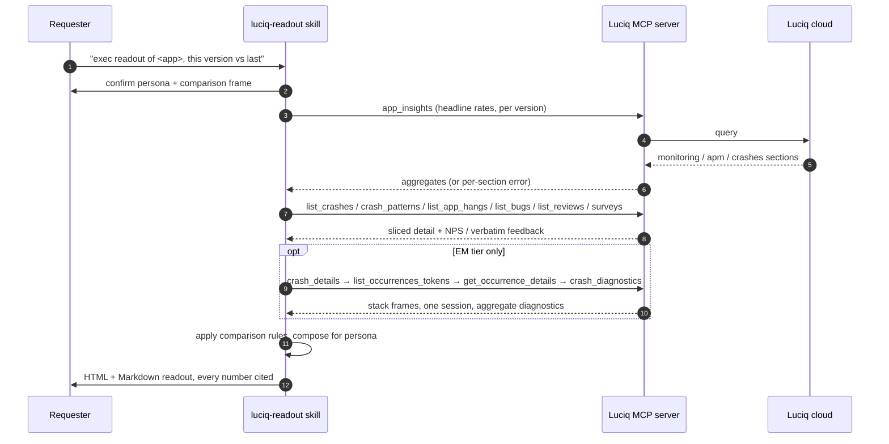
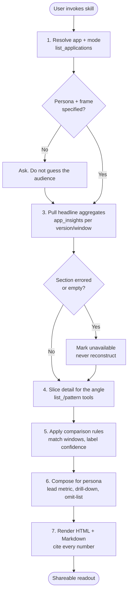
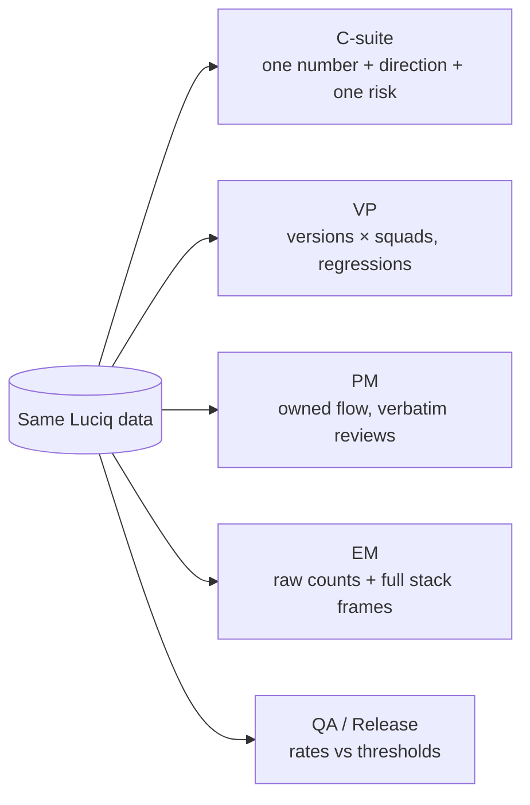
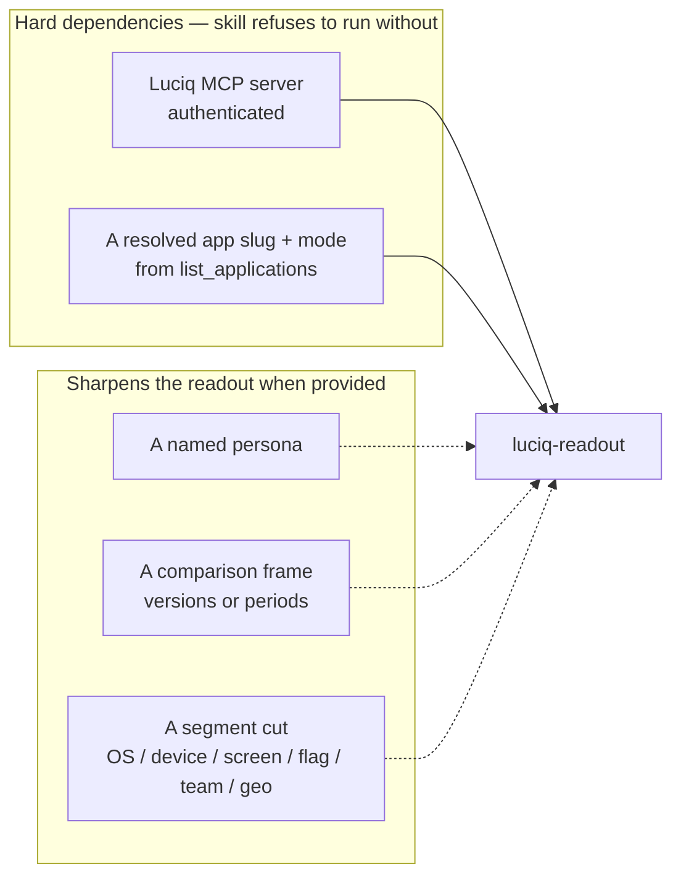

# luciq-readout

A Claude Code / Cursor skill that turns Luciq production data into a **shareable, audience-tailored readout** — an exec stability summary, a release comparison for a VP, a flow-health rollup for a PM — with every number cited to the MCP tool that produced it.

If you've ever been asked "give me a one-pager on how the app is doing for the leadership review" and ended up hand-assembling numbers from the dashboard, hoping you didn't transpose a digit — that's this skill. It pulls the data, renders it at the right altitude for the audience, and refuses to print a number it didn't query.

---

## What it does

The same app health data lands very differently depending on who's reading it:

- A **CEO** wants one stability number, the direction it's moving, and whether anything's on fire. A stacktrace in that summary is noise.
- A **VP** wants the new release compared to the last one, by squad, with the regressions flagged.
- A **PM** wants their own flow's health in users and journeys, plus what reviewers actually wrote.
- An **EM** wants the raw counts, the deltas, and the full stack frames to triage.
- **QA / Release** wants the candidate's rates laid against the team's ship bar.

`luciq-readout` composes the readout for the persona you name. It leads with that persona's metric, includes only their drill-down, and honors an explicit omit-list — so the exec summary stays an exec summary and the EM triage stays actionable.

The hard rule underneath all of it: **every figure is cited to its source tool and parameters, and nothing is fabricated.** If `app_insights` returns an error for a section, the readout says "unavailable for this window" — it does not quote a plausible-looking crash-free rate to fill the gap. A readout's only value is that the reader can trust every number in it.

---

## How it works

### Big picture



### The workflow



### Render at the right altitude



The persona spec — lead metric, exact tool calls, drill-down, omit-list, and a worked outline for each — lives in `references/persona-playbooks.md`. The omit-list is the load-bearing part: a C-suite readout that includes a device/OS matrix is a worse readout, not a more thorough one.

### Honest comparisons

When the readout compares two versions or two periods, it holds to a short set of rules so the comparison doesn't mislead:

- **Match the windows** — same `date_ms` length on both sides; rates and volumes both scale with exposure time.
- **Prefer rates over raw** where the tool gives them — `monitoring` rates compare cleanly; list counts are volume, not a like-for-like rate.
- **Label confidence by sample** — a version with thin exposure is "early rollout, low sample," cited from the `crash_patterns` session counts, not implied parity.
- **Separate new / regressed / trending** — three different stories, three different actions.
- **Segment before concluding** — a flat version-level delta can hide a device- or OS-specific regression.

### Grounding: what's exposed, what isn't

The readout is built only on what the Luciq MCP returns. Two specifics worth knowing before you read a report:

1. **`app_insights` does not expose app-level adoption** — you can't normalize its headline rates by rollout. The one adoption signal the MCP gives is **per-crash-group**, in `crash_patterns` (`adoption` per bucket + `total_sessions_count`). The skill uses that where it applies and never generalizes it into an app-wide rollout percentage.
2. **`app_insights` sections fail independently.** In live testing the `bugs` section frequently returns an error while `list_bugs` works fine. The skill reports the errored section as unavailable and pulls bug volume from `list_bugs` separately — it never presents one as the other.
3. **Four tools are stripped from the MCP client.** `update_bug`, `apm_list_groups`, `apm_group_view`, and `apm_occurrence` carry a top-level `anyOf`/`allOf`/`oneOf`/`not` combinator in their server-side input schema, which the Anthropic Messages API forbids — so Claude Code drops them from the in-session tool list. `update_bug` is irrelevant (a readout never writes). For per-span APM, the readout's performance dimension comes from the fully-callable `app_insights.apm` aggregate; the read-only `apm_list_groups` can optionally be reached by a direct JSON-RPC call when a persona needs slowest-endpoint / slowest-screen detail. This is a known server-side schema issue, not something the skill tries to fix.

Field shapes, metric meanings, the EM per-occurrence chain, the four-tool constraint, and the full do/don't on adoption are in `references/metrics-glossary.md`.

---

## How to use it

### Prerequisites



**Hard dependencies:**

1. **Luciq MCP server, authenticated.** The whole readout is grounded in `list_applications`, `app_insights`, `list_crashes`, `crash_patterns`, `list_app_hangs`, `list_bugs`, `list_reviews`, and the per-occurrence detail tools. Without it there's nothing to render. Run `luciq-setup` first, or follow the [MCP install guide](https://docs.luciq.ai/product-guides-and-integrations/product-guides/ai-features/luciq-mcp-server/setup-by-ide).
2. **A resolved app slug and mode.** Every tool keys off `(slug, mode)`; the skill calls `list_applications` and confirms with you. Default mode is `production`.

**Sharpens it when provided** (the skill asks if you don't): the **persona**, a **comparison frame** (version-vs-version or period-over-period), and an optional **segment cut**.

### First run

**The fastest invocation is the slash command** — type `/luciq-readout` and the skill takes over. You can pass arguments after it (e.g. `/luciq-readout exec summary of the iOS app, 3.1.4 vs 3.0.4`) and they're forwarded as the skill's `args`.

It also auto-activates on natural-language trigger phrases like:

- "give me an exec / leadership summary of the app"
- "build a release readout for version 3.1.4"
- "stability report for the VP"
- "how is the app doing this period vs last"
- "compare 3.1.4 to 3.0.4 for a PM"
- "a quality report I can forward to leadership"

What happens:

1. The skill resolves the app and mode via `list_applications` and confirms with you.
2. It confirms the **persona**, the **comparison frame**, and any **segment cut** — asking rather than guessing if they're unspecified.
3. It pulls the headline aggregates from `app_insights` (once per version or window), recording any errored or empty section as unavailable.
4. It slices the detail for your angle across the list and pattern tools.
5. It applies the comparison rules, then composes the readout at the persona's altitude.
6. It renders **HTML** (the shareable artifact) and **Markdown** (the inline preview), with every number cited to its tool and parameters.

### Reading the readout

The HTML is the forwardable artifact — a clean executive layout in Luciq brand blue (`#0A89FC`), a compact KPI band, and a visible source footer so any figure can be traced back to the tool and params that produced it. The Markdown mirrors it for pasting into Slack, a PR, or a doc.

Structure adapts to altitude: a C-suite readout is a few sentences and two or three trended numbers; an EM readout carries raw counts and stack frames. Every readout ends with a **Caveats** block listing unavailable sections, low-sample comparisons, and what adoption signal does and doesn't exist for the scope.

If the report is going outside the owning team, the skill anonymizes the app name.

---

## File map

```
plugins/luciq-skills/
├── commands/
│   └── luciq-readout.md          ← /luciq-readout slash command (invokes this skill)
└── skills/
    └── luciq-readout/
        ├── README.md             ← you are here (human-facing)
        ├── SKILL.md              ← LLM-facing instructions; the workflow definition
        └── references/
            ├── metrics-glossary.md   ← MCP tool surface, response shapes, what each metric means, adoption do/don't
            └── persona-playbooks.md  ← per-persona lead metric, tool calls, drill-down, omit-list, worked outlines
```

The references are loaded by the skill only when the workflow needs them — progressive disclosure keeps the main workflow document focused. The slash command file is a thin wrapper that maps `/luciq-readout` to invoking the skill.

---

## Status

This skill was finalized and tested end-to-end against **live Luciq MCP data** (an iOS demo app in production with multiple shipped versions). The workflow, tool surface, response shapes, and metric meanings were verified against real responses, including:

- `app_insights` at the app level and filtered per version (`3.1.4` vs `3.0.4`) — confirmed the four independent sections (`crashes`, `bugs`, `apm`, `monitoring`), the `value` / `rate` (change) pairing, and that the `bugs` section returns an error while `list_bugs` returns data.
- `list_crashes` and `list_app_hangs` sorted by occurrences and by affected users — confirmed the `occurrences_counter` / `affected_users_counter` / `current_view` / `team` fields and the `FATAL_UI_HANG` hang type.
- `crash_patterns` across `app_versions` and `oses` — confirmed the per-bucket `adoption` and `total_sessions_count` fields (the one real adoption signal), which corrected an earlier assumption that adoption was never exposed.
- The full **EM per-occurrence chain**, run end to end on the top crash group: `crash_details` (the `stack_frames[]` shape — `library` / `description` / `type` / `is_grouping_frame`) → `list_occurrences_tokens` (the ULID page + total) → `get_occurrence_details` (one session's device / memory / screen / state) → `crash_diagnostics` (the ready aggregate: screen-flow patterns, device/OS/version distributions, and the memory/battery/storage/duration histograms).
- `list_surveys` + `survey_details` — confirmed the NPS headline object (`score`, promoter / passive / detractor splits) and the verbatim "how can we do better" follow-up answers, used for the C-suite / VP / PM voice-of-customer dimension.
- `list_bugs` and `list_reviews` — confirmed the priority / status / rating / verbatim-body fields used for PM and exec tiers.
- The four-tool client strip — verified live that a server-side `tools/list` returns all 18 tools and exactly `update_bug` / `apm_list_groups` / `apm_group_view` / `apm_occurrence` carry a top-level combinator; the other 14 are callable via the MCP client, and the read-only `apm_list_groups` returns real per-span data via a direct JSON-RPC call.

A rendered sample readout (C-suite + VP + EM tiers — including the EM stacktrace / occurrence / diagnostics deep dive, an APM performance panel, and the in-app NPS) was produced from this data as part of finalization, every figure cited.

---

## Related skills

- **`luciq-debug`** — production crash / hang / bug investigation and a proposed fix. Different use case: one occurrence root-caused, not many summarized for an audience.
- **`luciq-verify`** — verify a Luciq SDK upgrade before shipping, against a synthetic smoke. This skill reports production health instead.
- **`luciq-setup`** — first-time SDK integration. Run this (and authenticate the MCP) before `luciq-readout` has anything to read.
