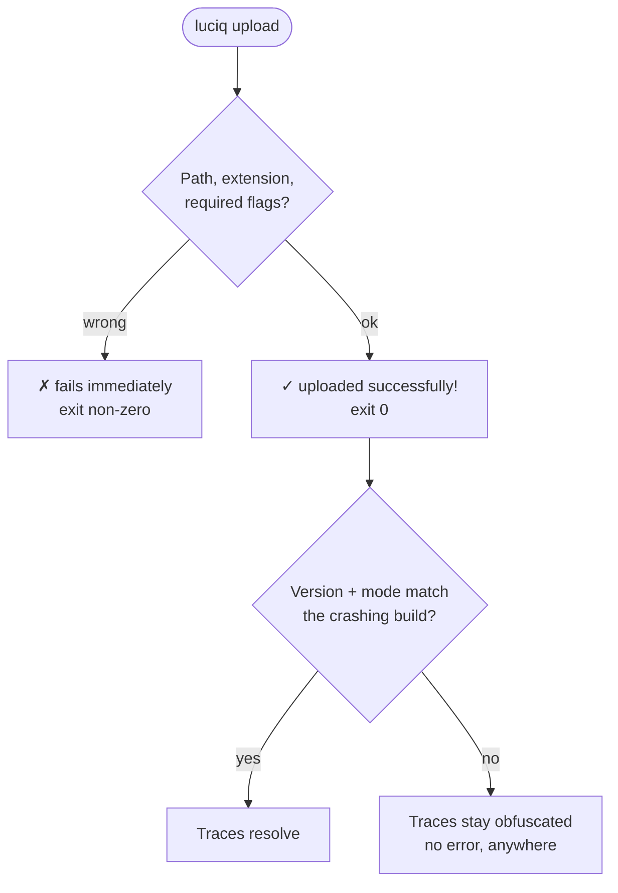
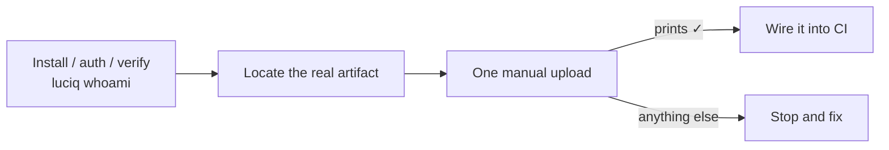

# luciq-symbolicate

A Claude Code / Cursor skill for making Luciq crash reports **readable** — uploading symbol files for every platform, and wiring those uploads into a release pipeline so it never depends on anyone remembering.

If you've ever shipped a release and then found the crash reports were unreadable because nobody uploaded the mapping file, this is the skill for that.

---

## What it does

Symbol files are how Luciq turns `0x1004a2f18` back into `Checkout.applyPromo(Checkout.kt:214)`. Uploading them is the one Luciq capability with **no MCP tool at all** — the `luciq` CLI is the only path — so this skill installs and authenticates the CLI itself, then drives it.

It covers all five artifact types and their traps:

| Type | Subcommands | Required beyond `--slug` / `--mode` | Extension enforced |
| --- | --- | --- | --- |
| dSYM | `*-ios-dsym` | nothing | `.zip` |
| Mapping | `*-android-mapping` | `--version-name`, `--version-code` | any |
| RN source map | `react-native-*-sourcemap` | `--version-name`, `--version-code` | `.json` / `.txt` |
| Flutter Dart symbols | `flutter-*-sourcemap` | `--version-name`, `--version-code` | `.zip` |
| NDK | `*-ndk` | `--version-name`, `--arch` (not `--version-code`) | `.zip` |

---

## Why it exists

**Three flags fail silently, and they are the whole reason.** Get `--mode`, `--version-name` or `--version-code` wrong and the upload returns `✓ uploaded successfully!` with exit `0`. Nothing errors. You find out weeks later, from a stack trace that is still hex.



That silent branch is what the skill is built to prevent. It reads the version off the build system rather than from memory, confirms the mode the build actually reports to, and treats `luciq upload help <subcommand>` as outranking its own tables whenever a flag is rejected.

### The hard gate



**One manual upload must print `✓` before any CI file is touched.** A committed pipeline step that has never uploaded successfully is an untested change on a release path, and its failure mode is silent. One manual run proves the artifact path, the credentials, the upload permission, the app and mode resolution, and the flag set in a single shot. `luciq whoami` proves none of them.

### One credential, and what it implies

A CLI token carries its owner's own dashboard role. It is **not** a service account. So an upload step in CI runs as a *person*, needs `settings.mapping_files.modify` on the app on top of CLI access, and breaks when that person rotates their token or leaves. The skill says so when wiring a pipeline instead of leaving it to be discovered later.

---

## How to use it

### Prerequisites

Nothing but a shell. The MCP server isn't involved at all. The skill installs and authenticates the CLI as its first step; all you supply is a CLI token, generated at [dashboard.luciq.ai/company/luciq-cli](https://dashboard.luciq.ai/company/luciq-cli).

### Try saying

- `"Our Android crashes aren't deobfuscated — fix it"`
- `"The stack trace in Luciq is just hex addresses"`
- `"Upload the dSYMs for this build to Luciq"`
- `"Add Luciq symbol upload to our GitHub Actions release workflow"`
- `"Our beta builds need symbols too"`

### What you get

A command shown before it runs, with real paths and secrets as `"$VAR"`; a manual upload proven before any pipeline edit; a diff plus a note of exactly which secret to configure where. When a crash is still unreadable afterwards, a nine-step triage that starts where the answer usually is.

---

## File map

```
plugins/luciq-skills/
├── commands/
│   └── luciq-symbolicate.md          ← /luciq-symbolicate slash command
└── skills/
    └── luciq-symbolicate/
        ├── README.md                 ← you are here (human-facing)
        ├── SKILL.md                  ← LLM-facing instructions; the workflow definition
        └── references/
            ├── upload-matrix.md      ← upload subcommands, artifact locations, required flags, format traps
            ├── ci-recipes.md         ← GitHub Actions, Fastlane, Gradle, Bitrise, CircleCI, Xcode phase, cron
            └── troubleshooting.md    ← error → cause → fix, upload permissions, unsymbolicated triage
```

References load only when the current step needs them.

---

## Status

The command surface, flags, enum values, error text, and exit-code behavior were derived from the `luciq-cli` source and the server-side gateway that serves its commands, and cross-checked against the public [CLI docs](https://docs.luciq.ai/product-guides-and-integrations/product-guides/luciq-cli/getting-started).

Verified by running the CLI: Thor's argument-validation messages, the `✗ Request failed (401)` shape, local pre-flight validation on uploads (path, readability, `.zip`-vs-`.json`, `--arch`), non-zero exit on failure, and that CLI errors print to **stdout** while argument errors print to **stderr** — which is why the skill says to trust the exit code, not an empty stderr.

Read from the gateway source rather than assumed: the `account_management.cli.view` gate, the extra `settings.mapping_files.modify` on uploads, and the **100 requests / 60 s per source IP** rate limit — keyed by IP, so a matrix build pushing several platforms and ABIs shares one budget with everything else on that runner.

Real symbol uploads weren't exercised end to end against production. The standing rule for anything that drifts: `luciq upload help <subcommand>` outranks these tables.

---

## Related skills

- **`luciq-automate`** — the other half of the CLI: exports, aggregation, scheduled jobs, and gating a build on a metric.
- **`luciq-debug`** — root-cause one crash, hang, bug, or regression against your repo, via MCP. Use it once the trace is already readable; use this skill to make it readable.
- **`luciq-readout`** — an audience-tailored health report, via MCP.
- **`luciq-setup`** — first-time SDK integration. This skill installs a CLI, not an SDK.
