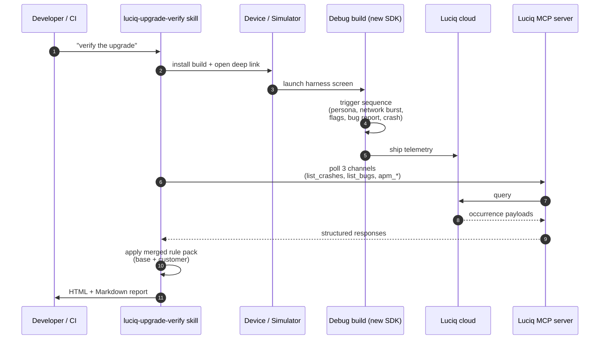
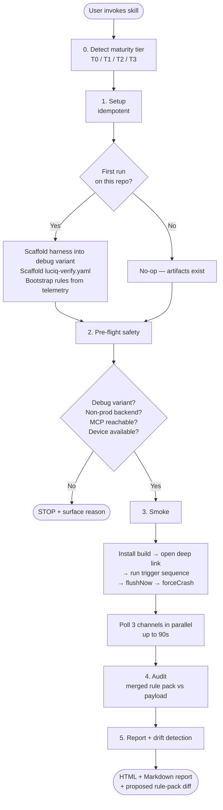
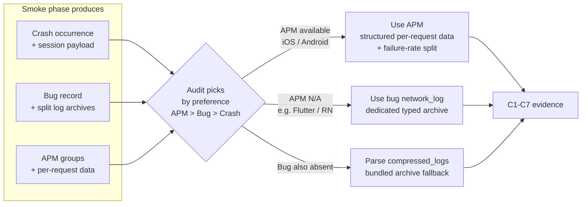
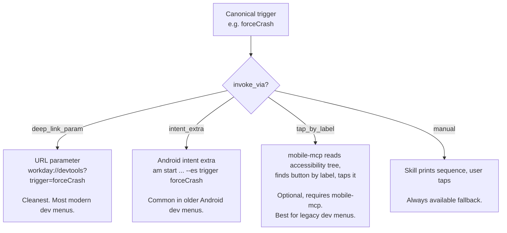
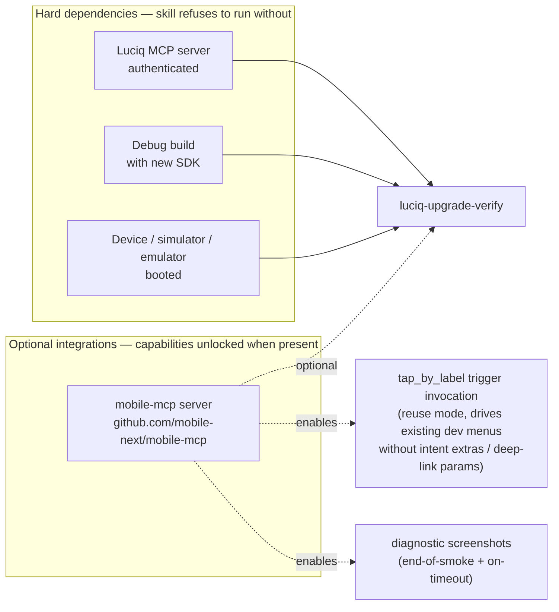
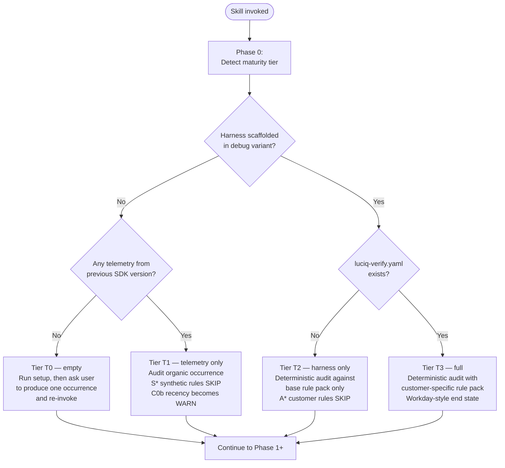

# luciq-upgrade-verify

A Claude Code / Cursor skill that verifies a Luciq mobile SDK upgrade end-to-end **before** you ship — by smoking your debug build, pulling the resulting telemetry, and auditing it against your custom integration's contract.

If you've ever upgraded an SDK and asked "did our redaction callbacks still fire? are our custom headers preserved? did the new SDK version sneak any PII into user steps?" — that's this skill.

---

## What it does

When you bump the Luciq SDK version, several things can silently break:

- A redaction callback's contract changes — your "replace body with `WD-REDACTED`" hook compiles but no longer fires.
- A new HTTP client (Ktor / OkHttp release) isn't intercepted — that traffic now ships **unredacted**.
- The SDK adds new auto-instrumentation that captures TextField contents — PII suddenly appears in user steps even though your code didn't change.
- An attribute key gets renamed (`persona` → `user_persona`) — your 5 persona tags stop reporting.
- A feature-flag length cap drops from 70 → 50 — flags get truncated and stop matching the dashboard.

None of these break a build. None of them fail a unit test. They just silently leak PII or drop signal in production. **This skill catches them.**

The audit verifies (configurable per customer via `luciq-verify.yaml`):

- **Network capture**: URL normalization, custom headers preserved, request/response bodies redacted, sensitive headers absent, attachment URL paths masked, task tracer correlation IDs present, no SDK self-traffic.
- **PII**: regex sweep over user steps, attribute values, URL query strings, identity fields.
- **Attributes**: required user attributes (tenant, locale, persona) present; numbered custom-attribute slots populated.
- **Experiments / feature flags**: count above floor, key length within truncation limit.
- **SDK hygiene**: no `warn` or `error` lines from Luciq itself in the app log.
- **Synthetic markers**: the test crash actually landed, breadcrumbs captured at the expected threshold.
- **Environment**: SDK version matches the one under test, debug build pointed at non-prod backend.

---

## How it works

### Big picture



The skill drives a real SDK in a real app, then audits what actually shipped. No mocks, no test doubles — the dashboard is the oracle.

### The 5-phase workflow



### Three audit channels, picked by preference

| Channel | What it gives | When it's used |
| --- | --- | --- |
| **APM** (`apm_*` MCP tools) | Per-request structured network data, with built-in failure-rate split | Primary for redaction / headers (iOS + Android only) |
| **Bug** (`bug_details` MCP tool) | Network log, breadcrumbs, and SDK log as **separate** named archives | Cleanest fallback after APM; available on every platform |
| **Crash** (`get_occurrence_details` MCP tool) | All session data bundled into one archive that needs parsing apart | Always used for the synthetic crash itself, attributes, environment, occurrence identity |

The skill polls all three channels in parallel during the smoke and prefers APM > Bug > Crash for network audit. If APM isn't GA on your account, the bug channel covers it. If both are unavailable, the crash channel's `compressed_logs` archive is parsed as a fallback.



For everything other than network capture — synthetic markers, attributes, occurrence identity, environment — the crash channel is always used because that's where `current_view`, `state.fields.app_version`, `state.fields.sdk_version`, and the synthetic marker live.

### Dashboard as oracle

The skill doesn't write unit tests or mock the SDK. It drives your debug build through a deterministic harness, lets the **real SDK in a real app** ship telemetry to the Luciq backend, then pulls that telemetry back via the Luciq MCP server and asserts against it. End-to-end behavioral verification.

### The 5 phases

```
0. Detect customer maturity tier (drives phase shape below)
1. Setup        — idempotent; scaffolds the harness and rule pack on first run
2. Pre-flight   — safety: SDK version, debug variant, non-prod backend, MCP reachable
3. Smoke        — drive the harness, wait for the occurrence to land
4. Audit        — apply rules from the merged rule pack against the captured payload
5. Report       — render HTML + Markdown report; propose rule-pack drift updates
```

First run does heavy setup (harness scaffold, rule-pack bootstrap, environment confirmation). Every subsequent SDK upgrade is a 2-minute "press go."

### Two harness modes — scaffold or reuse

The skill supports two ways of getting deterministic triggers into your debug build. Pick one in your `luciq-verify.yaml`:

**Scaffold (default).** The skill writes a small harness directly into your debug variant — *not* a published package. Per platform:

- **iOS**: `<App>/DebugOnly/UpgradeVerify/UpgradeVerifyHarness.swift` with `#if DEBUG` guards
- **Android**: `app/src/debug/java/<pkg>/upgradeverify/` (debug sourceSet only)
- **Flutter**: `lib/upgrade_verify/` mounted only under `kDebugMode`
- **React Native**: `src/upgrade-verify/` gated by `if (__DEV__)`
- **KMP**: `shared/src/debugMain/` plus thin platform shims

The scaffolded harness exposes a small API (`setTestPersona`, `fireNetworkBurst`, `exerciseFeatureFlags`, `reportBugReport`, `forceCrash`, `forceANR`, `forceUIHang`, `flushNow`) plus a one-button-per-trigger screen reachable via `luciq://upgrade-verify-harness` in debug builds only.

**Reuse.** Already have a debug menu with crash / hang / bug triggers (Workday's `DeveloperToolsFragment`, a `CrashLab` / `HangTrigger` / `ErrorTrigger` family, etc.)? Declare it instead of scaffolding a parallel one. Your rule pack maps the canonical triggers to your existing methods, and declares **how** each trigger should be invoked.

Four invocation strategies, picked per trigger by `invoke_via`:



```yaml
harness:
  mode: reuse
  reused_surface:
    marker_view: "DeveloperToolsFragment"        # what current_view is on occurrences from this screen
    deep_link: "myapp://devtools"                # optional, for hands-free smoke
    triggers:
      # Shorthand → invoke_via: manual
      setTestPersona: "PersonaTrigger.setTestPersona"

      # Object form with explicit strategy
      forceCrash:
        method: "CrashTrigger.forceUnwrapNil"
        invoke_via: "intent_extra"
        param_name: "trigger"
        param_value: "forceUnwrapNil"

      reportBugReport:
        method: "BugTrigger.reportFromDevTools"
        invoke_via: "tap_by_label"               # requires mobile-mcp (optional)
        label: "Report Bug"

      flushNow: "LuciqSDK.flushNow"
```

The skill verifies the marker view actually surfaces in past occurrences, checks the surface is debug-gated, then drives your existing methods during the smoke. Unmapped triggers become no-ops and the rules that needed them SKIP — the audit degrades gracefully.

Either mode produces `luciq-verify.yaml` at the repo root — your rule pack, where customer-specific rules live (redaction tokens, allowed hosts, required headers, attribute schema, PII regex).

---

## How to use it

### Prerequisites

The skill has **hard dependencies** (it refuses to run without them) and **optional integrations** (it gains capabilities when they're present but works fine without).



**Hard dependencies:**

1. **Luciq MCP server, authenticated.** The entire audit is grounded in what the Luciq MCP exposes — `list_applications`, `list_crashes`, `list_bugs`, `list_occurrences_tokens`, `get_occurrence_details`, `bug_details`, `crash_patterns`, and (when GA) `apm_*`. Without it the skill has no oracle to verify against. Run `luciq-setup` first if you haven't, or follow https://docs.luciq.ai/product-guides-and-integrations/product-guides/ai-features/luciq-mcp-server/setup-by-ide.
2. **A debug-variant build with the new SDK.** The skill bumps no dependencies — it audits whatever's in your lockfile.
3. **A booted device, simulator, or emulator.** The skill drives the build via deep link (or via mobile-mcp when present); nothing for you to tap manually unless reuse mode falls back to manual triggers.

**Optional integrations:**

- **[mobile-mcp](https://github.com/mobile-next/mobile-mcp).** Adds two capabilities:
  - **`tap_by_label` triggers** in reuse mode. If your existing dev-tools menu doesn't accept intent extras or deep-link params (legacy dev menus often don't), mobile-mcp reads the device's accessibility tree and taps your buttons by label — no app changes required to make reuse mode hands-free.
  - **Diagnostic screenshots.** End-of-smoke screenshots (proof your harness was reachable) and timeout screenshots (what was on screen when no occurrence landed). Opt in via `optional_integrations.mobile_mcp.screenshot_on_smoke_end` / `screenshot_on_smoke_timeout`.

  Without mobile-mcp, `tap_by_label` triggers degrade to manual (the skill prints the trigger sequence; you tap) and screenshots are simply not captured. Pre-flight still passes — unless your rule pack sets `optional_integrations.mobile_mcp.enabled: force`.

### What the skill checks before doing anything



The skill reports the detected tier explicitly — users often don't know which tier they're in until told.

### First run

**The fastest invocation is the slash command** — type `/luciq-verify` and the skill takes over. You can pass arguments after it (e.g. `/luciq-verify 19.6.0`) and they're forwarded as the skill's `args`.

The skill also auto-activates on natural-language trigger phrases like:

- "verify the Luciq upgrade"
- "audit Luciq 19.6.0"
- "did the SDK bump break anything"
- "run upgrade verification"
- "is it safe to release this version"
- "smoke the new Luciq SDK"

What happens on first run:

1. The skill detects your platform and asks for confirmation before doing anything that writes files.
2. **Harness setup, branching on your rule-pack `harness.mode`:**
   - **`scaffold` (default)** — generates `UpgradeVerifyHarness.<ext>` into your debug variant and shows you the diff.
   - **`reuse`** — validates the `reused_surface` declaration in your rule pack: confirms the `marker_view` exists on prior occurrences, checks the surface is debug-gated, surfaces gaps. No source generation.
3. It scaffolds `luciq-verify.yaml` at the repo root if it doesn't exist. If you have ≥ 10 prior occurrences on the previous SDK version, it proposes a rule pack populated from your observed telemetry. You review and accept block-by-block.
4. It runs pre-flight safety checks (debug variant, non-prod backend, MCP reachable, device available).
5. It launches your harness (deep link if available, otherwise activity intent, otherwise prompts you), fires the canonical trigger sequence, and polls the three audit channels in parallel.
6. It audits the payload and renders the report.

The rule pack lives in your repo and is version-controlled like any other file. Edit it directly when your contract changes.

### Subsequent runs

After the first run, invoking the skill again skips setup (harness is already there, rule pack exists) and goes straight to pre-flight → smoke → audit → report. The skill also runs **drift detection** — if it sees new attribute keys, new headers, new SDK API call sites, or rules that haven't fired in N runs, it proposes a unified diff against your rule pack for you to accept or reject.

### Reading the report

Two artifacts are produced in your repo root:

- `luciq-upgrade-verify-report.html` — colored status pills, expandable evidence rows, network audit table. Open in a browser.
- `luciq-upgrade-verify-report.md` — same content as Markdown, suitable for pasting into a PR or CI log.

Each row in the verification checks table is one of:

| Status | Meaning |
| --- | --- |
| `PASS` | Rule fired, evidence satisfies the assertion |
| `FAIL` | Rule fired, evidence violates the assertion — **release-blocking** |
| `WARN` | Rule fired, evidence is borderline |
| `INFO` | Informational signal, not an assertion |
| `SKIP` | Rule could not run — reason surfaced (e.g. "evidence field missing") |
| `MANUAL` | Requires dashboard verification — surfaced at the top of the report |
| `DISABLED` | Rule is in the pack but explicitly turned off |
| `N/A` | Rule doesn't apply to this platform / SDK version |

A single `FAIL` blocks the release. `MANUAL` items don't block automatically but appear at the top so you can verify them quickly in the dashboard.

If mobile-mcp is installed and screenshots are enabled in your rule pack, the report's "Test environment" block also embeds an end-of-smoke screenshot (proof the harness was reachable) and, on Phase 3c timeouts, a diagnostic screenshot of whatever was on screen when polling gave up.

### Two run modes

| Mode | When | What changes |
| --- | --- | --- |
| **synthetic** (default) | Pre-release SDK upgrade verification | The skill drives the harness, audits the synthetic occurrence |
| **prod canary** (explicit `--mode=prod-canary`) | Day-1 of a staged rollout | Skips the smoke; audits real-user production traffic from the new SDK. Adds an SDK-version regression diff across `app_versions`, `oses`, `devices`, `current_views`, `app_status`, `experiments`. PII findings are release-blocking. |

The skill refuses to audit production traffic without the explicit mode flag.

---

## File map

```
plugins/luciq-skills/
├── commands/
│   └── luciq-verify.md          ← /luciq-verify slash command (invokes this skill)
└── skills/
    └── luciq-upgrade-verify/
        ├── README.md            ← you are here (human-facing)
        ├── SKILL.md             ← LLM-facing instructions; the workflow definition
        └── references/
            ├── payload-schemas.md  ← MCP tool surface, response shapes, wire formats for log archives
            ├── check-catalog.md    ← Full E/C/S/P/A/T/U rule catalog with evidence sources
            ├── rule-pack-format.md ← luciq-verify.yaml schema, base pack, Workday-style example
            └── harness-contract.md ← Scaffold + reuse modes, per-platform paths, API surface, gating
```

The references are loaded by the skill only when the corresponding phase needs them — progressive disclosure keeps the main workflow document focused. The slash command file is a thin wrapper that maps `/luciq-verify` to invoking the skill.

---

## Status

**This skill is currently in draft.** The workflow, rule catalog, payload schemas, and harness contract are designed and verified against:

- Real `get_occurrence_details` payloads (iOS CRASH, NON_FATAL, FATAL_UI_HANG — all share one shape)
- Real `bug_details` payload (iOS Bug — with split log archives, root-level `experiments`, integer `state_number`)
- Real fetched **bug-channel archives** (`network_log`, `user_events`, `instabug_log`) — all plain JSON, element shapes documented in `references/payload-schemas.md`
- Real fetched **crash-channel `compressed_logs`** — confirmed encoding is **base64 → zlib → JSON object** with sub-archives keyed by name (e.g. `network_log`)
- The MCP server source on the `feat/APM-network` branch (input schemas + RSpec response fixtures)

What's still being verified:

- Android / Flutter / React Native occurrence payloads (only iOS verified live; structure expected to be identical, only `current_view` semantics differ per platform).
- APM tools on a real account (verified from MCP source + fixtures, not yet probed live).
- `console_log` and `user_data` bug-channel archives (empty in every sample observed so far; element shape TBD on first non-empty sample).

When those land, the relevant "verify live" notes in the references will be replaced with concrete field paths or parsers.

### Behavioral findings worth knowing before you write your rule pack

These came out of inspecting real SDK traffic and may surprise customers:

1. **The SDK ships its own telemetry to `api.instabug.com`** and that traffic appears in the captured network log. C7 ("no SDK self-traffic") cannot PASS unless your rule pack's `network.url_exclude_hosts` lists those hosts. The default rule pack includes `api.instabug.com` and `*.luciq.com` for this reason.
2. **The SDK auto-redacts sensitive header values to `*****`** (e.g. `Authorization: *****`). That's the SDK's own sentinel — distinct from your customer redaction token. C4 PASSes when it sees this.
3. **The SDK truncates request bodies > 10240 bytes** with a literal "Request body has not been logged because it exceeds the maximum size of 10240 bytes" string. This bypasses your redaction callback. The audit treats it as INFO, not PASS — your large requests aren't covered by your masking rules.
4. **The `IBG-APP-TOKEN` header is NOT auto-redacted.** That's your dashboard credential, plaintext in every outbound SDK request. If you want it masked in the log, add `IBG-APP-TOKEN` to `redaction.sensitive_headers`.
5. **The `instabug_log` archive is your app's logs (via `Luciq.log.i/.w/.e/.v`),** not the SDK's internal log. C9 ("no SDK warn/error") scans `console_log` (or grep inside the decoded `compressed_logs`), not `instabug_log`.

---

## Related skills

- **`luciq-setup`** — first-time SDK integration. Run this before `luciq-upgrade-verify` can work.
- **`luciq-migrate`** — Instabug → Luciq rename, or vN → vN+1 API transforms. Run this *before* `luciq-upgrade-verify` audits the result.
- **`luciq-debug`** — production crash / hang / bug investigation. Different use case: real-user signal, not synthetic verification.
